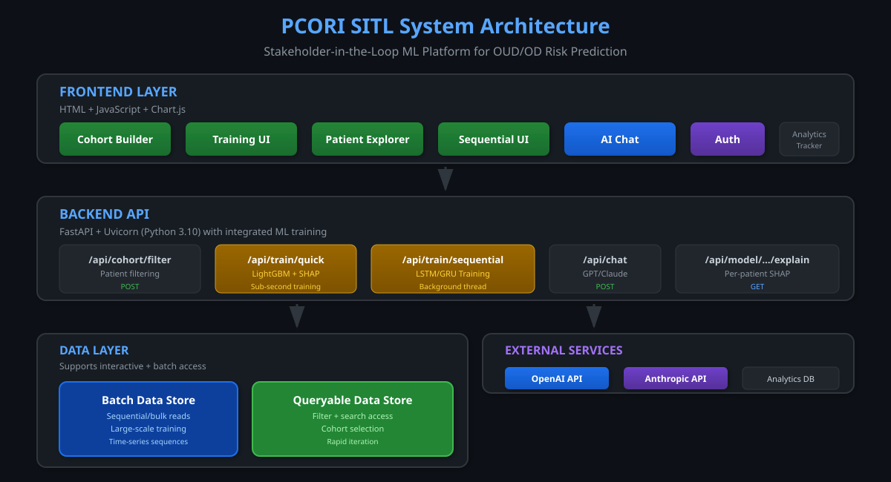
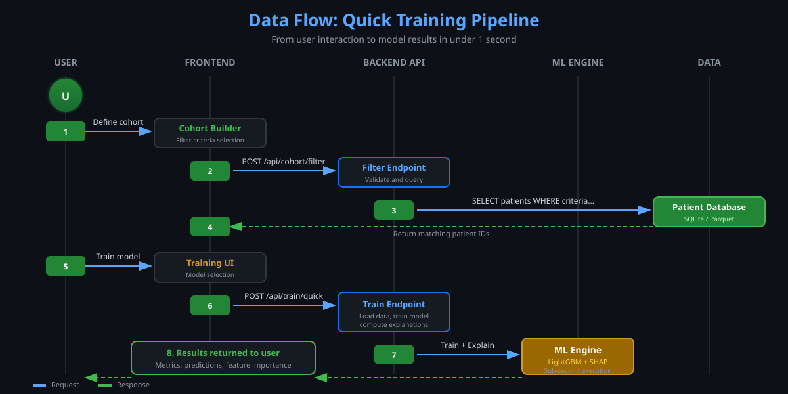

# SITL: Stakeholder-in-the-Loop Platform for Clinical Risk Modeling

**Stakeholder-in-the-Loop (SITL)** is an interactive clinical ML validation platform that places clinicians at the model-validation boundary, where cohort definitions, model behavior, and risks are jointly examined. It targets opioid use disorder and overdose risk prediction, addressing the persistent gap between model development and clinical adoption.

## The Problem

Preventable opioid overdose deaths remain a critical public health challenge. Frontline clinicians need transparent, workflow-compatible tools to identify high-risk patients early. Yet machine learning models frequently fail to reach practice due to:

- **Opacity**: Clinicians cannot trust predictions they do not understand
- **Disconnect**: Models are trained on data clinicians never see or verify
- **Slow iteration**: Weeks to retrain models versus minutes of clinician availability
- **Passive role**: Existing human-in-the-loop approaches emphasize annotation, leaving clinicians as recipients rather than collaborators

SITL repositions stakeholder expertise at the validation boundary, enabling clinical judgment to refine cohort definitions, evaluate model outputs, and surface risks before any model reaches practice.

## Contributions

**C1. Iterating with clinician input**: A shared workflow that integrates patient-group construction, model training, and review of patient-level predictions within one interface for transparent model validation.

**C2. Reviewable explanation logs**: SHAP-based feature contributions (SHapley Additive exPlanations) with logging of explanation views, cohort edits, and model reruns to support repeatable results and oversight.

**C3. Constrained LLM explanations**: Natural-language explanations limited to computed feature contributions, clearly labeled for research use only.

---

## System Architecture



The platform uses a three-layer architecture:

| Layer | Technology | Components |
|-------|------------|------------|
| **Frontend** | HTML + JS + Chart.js | Cohort Builder, Training UI, Patient Explorer, Sequential UI, AI Chat |
| **Backend API** | FastAPI + Uvicorn | REST endpoints, integrated ML training (LightGBM, LSTM/GRU), auth middleware |
| **External Services** | Cloud APIs | OpenAI (GPT), Anthropic (Claude) for natural language explanations |
| **Data Layer** | Parquet + SQLite | EHR data, Patient database |

---

## Data Flow



### Quick Training Pipeline

The diagram above shows the 8-step flow from user interaction to model results:

1. **User defines cohort** through the Cohort Builder interface
2. **Frontend sends filter request** via `POST /api/cohort/filter`
3. **Backend queries database** for matching patients
4. **Patient IDs returned** to frontend
5. **User clicks Train** in the Training UI
6. **Training request sent** via `POST /api/train/quick`
7. **ML Engine executes** LightGBM + SHAP computation
8. **Results returned** including metrics, predictions, and feature importance

### Sequential Training Flow

For temporal modeling with LSTM/GRU:

1. User selects parameters: T (sequence length), feature set, normalization
2. API loads pre-computed sequences from Parquet cache
3. Chunked loading: 50k samples at a time for memory efficiency
4. PyTorch model training with progress callbacks
5. Returns AUROC, loss curves, per-epoch progress

---

## Illustrative Use Case

A clinical researcher seeks to identify patients at elevated overdose risk within a primary care panel:

1. **Define patient group**: Adults 18-65 with opioid prescriptions in the past year
2. **Train model**: One-click training produces an interpretable model with feature explanations
3. **Review explanations**: Global feature importance shows which factors drive predictions
4. **Drill into cases**: Per-patient explanations reveal individual risk factors
5. **Iterate**: Adjust the cohort definition and retrain to explore subpopulations
6. **Export**: Risk scores and explanations ready for care coordination

---

## Technical Implementation

### Data Model

The system is designed to work with **any tabular patient data** containing clinical features and a binary outcome. The data layer supports multiple data sources through a unified adapter pattern.

| Data Source | Format | Use Case |
|-------------|--------|----------|
| Development Data | SQLite | Rapid prototyping with representative patient cohorts |
| Production EHR Data | Parquet | Large-scale Health Facts data with millions of records |
| Sequential Data | NumPy arrays | Time-series patient trajectories for LSTM/GRU |

**Sequential Data Loading Example:**
```python
from backend.data_loader import get_health_facts_sequences

# Load pre-processed sequential data
data = get_health_facts_sequences(
    T=10,                      # Sequence length (time steps)
    feature_set="core",        # Feature subset
    normalization="standard",  # Normalization method
)

# Returns dict with numpy arrays:
# - X_train: (N, T, D) training sequences
# - y_train: (N,) training labels
# - X_val, y_val: validation data
```

### Model Types

| Model | Library | Training Time | Use Case |
|-------|---------|---------------|----------|
| LightGBM | lightgbm | <1 second | Rapid iteration, tabular data |
| Logistic Regression | scikit-learn | <1 second | Baseline, interpretability |
| LSTM | PyTorch | Minutes | Temporal patterns, sequences |
| GRU | PyTorch | Minutes | Temporal patterns, faster training |

### Explainability

All models provide SHAP (SHapley Additive exPlanations) feature contributions:

- **Global importance**: Which features matter most across all patients
- **Per-patient explanations**: Why a specific patient received their risk score
- **LLM interpretation**: Optional GPT/Claude natural language summaries (research use only)

---

## API Reference

### Core Endpoints

| Method | Endpoint | Description |
|--------|----------|-------------|
| `POST` | `/api/cohort/filter` | Filter patients by criteria |
| `POST` | `/api/train/quick` | LightGBM/LogReg training + SHAP |
| `GET` | `/api/models` | List trained models |
| `GET` | `/api/model/{id}/explain/patient/{pid}` | Per-patient SHAP values |
| `POST` | `/api/chat` | GPT/Claude interpretation |

### Sequential Training Endpoints

| Method | Endpoint | Description |
|--------|----------|-------------|
| `GET` | `/api/dataset/health_facts_seq/config` | Feature sets & options |
| `POST` | `/api/dataset/health_facts_seq/train` | LSTM/GRU training |
| `GET` | `/api/dataset/health_facts_seq/training/{job_id}` | Training progress |

### Example: Quick Train Request

```json
// POST /api/train/quick
{
  "model_type": "lightgbm",
  "patient_ids": ["P001", "P002", ...],
  "features": ["age", "prescription_count", "prior_overdose", ...]
}

// Response
{
  "model_id": "m_abc123",
  "metrics": { "auroc": 0.823, "auprc": 0.612, "accuracy": 0.784 },
  "feature_importance": { "prior_overdose": 0.42, "prescription_count": 0.31, ... },
  "training_time_ms": 287
}
```

---

## Directory Structure

```
sitl_dashboard/
├── backend/
│   ├── main.py              # FastAPI application
│   ├── config.py            # Configuration and constants
│   ├── data_loader.py       # Data loading utilities
│   ├── database.py          # SQLite patient database
│   ├── analytics.py         # Session tracking
│   ├── sequential_endpoints.py  # LSTM/GRU training
│   └── job_integration.py   # Background training
├── frontend/
│   ├── index.html           # Main dashboard
│   └── sequential.html      # Sequential training UI
├── data/
│   └── patients.db          # SQLite database
├── tests/
│   └── test_api_behavior.py # API behavior tests
└── docs/
    ├── architecture.svg     # System architecture diagram
    └── dataflow.svg         # Data flow diagram
```

---

## Quick Start

```bash
# Clone repository
git clone https://github.com/elinaliu-stony/pcori-sitl-report-2026.git
cd pcori-sitl-report-2026

# Install dependencies
pip install -r requirements.txt

# Initialize database
python backend/init_db.py

# Start server
python -m uvicorn backend.main:app --host 0.0.0.0 --port 8503
```

### Environment Variables

```bash
export DATA_ROOT="/path/to/data"           # Pre-processed data location
export OPENAI_API_KEY="sk-..."             # For AI chat (optional)
export ANTHROPIC_API_KEY="..."             # For AI chat (optional)
```

---

## Testing

```bash
# Run all tests
python -m pytest tests/ -v

# Manual API testing
curl http://localhost:8503/health

curl -c cookies.txt -d "username=demo&password=demo" \
  http://localhost:8503/api/login

curl -b cookies.txt -X POST http://localhost:8503/api/cohort/filter \
  -H "Content-Type: application/json" \
  -d '{"age_min": 30, "age_max": 60}'
```

---

## Limitations & Planned Work

**Current Scope:**
- This release provides a research prototype validated with synthetic and de-identified EHR data
- Sequential model explanations use SHAP approximations requiring further evaluation

**Planned Evaluation:**
- IRB-approved mixed-methods study with clinical stakeholders (in preparation)
- Prospective validation with live EHR integration
- Investigation of automation bias and mitigation strategies

---

## Security Considerations

**Current (Research Prototype):**
- Simple username/password authentication
- Cookie sessions with 30-day expiry
- Permissive CORS for development

**Production Recommendations:**
- Environment variables for secrets
- Password hashing (bcrypt)
- HTTPS + rate limiting
- Role-based access control
- Audit logging

---

## Project

PCORI Stakeholder-in-the-Loop Project | Stony Brook University

*Research tool for transparent ML validation with clinical stakeholders*
