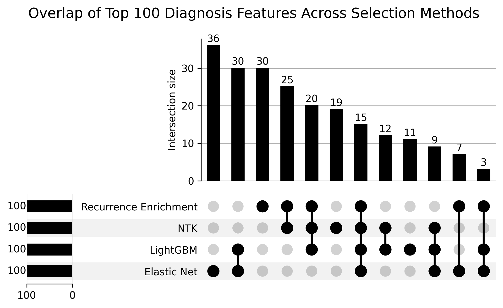
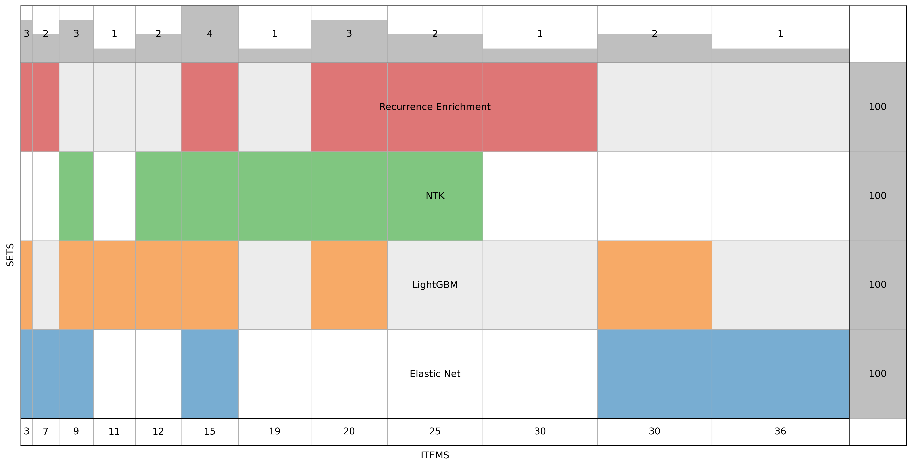

# Feature Selection Methods

This document describes the feature selection approaches used in the PCORI project for identifying predictive clinical features for OUD/OD risk.

## Overview

We employ an ensemble approach combining multiple feature selection methods. Features selected by 3 or more methods are considered robust predictors.

## Methods

### 1. NTK-Inspired Sensitivity Analysis

Neural Tangent Kernel (NTK) inspired method for measuring feature sensitivity.

**Location:** `feature_selection/diagnosis/ntk_inspired_sensitivity.py`

**Output:** `feature_selection/diagnosis/ntk_full.csv`

### 2. LightGBM Feature Importance

Gradient boosting-based feature importance using LightGBM.

**Location:** `feature_selection/diagnosis/machine_learning/run_ml_feature_selection.py`

**Output:** `feature_selection/diagnosis/lightgbm_full.csv`

### 3. Elastic Net Regularization

L1/L2 regularized regression coefficients for feature ranking.

**Output:** `feature_selection/diagnosis/elastic_net_full.csv`

### 4. Recurrence Enrichment

Statistical enrichment analysis based on condition recurrence patterns.

**Location:** `feature_selection/diagnosis/recurrence_enrichment.py`

**Output:** `feature_selection/diagnosis/recurrence_enrichment_full.csv`

### 5. LLM-Guided Selection

Large language model assisted feature ranking based on clinical knowledge.

**Output:** `feature_selection/diagnosis/llm_full.csv`

## Ensemble Results

Features appearing in 3+ methods:
- `feature_selection/diagnosis/features_3plus_methods_top100.csv`
- `feature_selection/diagnosis/features_3plus_methods_top500.csv`

## Visualization

### Upset Plot
Shows overlap between different feature selection methods.



### Venn Diagram
Visualizes method agreement for top features.



## Lab Features

Lab-based feature selection is in `feature_selection/labs/`:

- `lab_feature_selection.py` - Main selection logic
- `lab_ntk_feature_selection.py` - NTK method for labs
- `compute_lab_abnormal_summary.py` - Abnormal value analysis

## Usage

```python
import pandas as pd

# Load ensemble results
features = pd.read_csv('feature_selection/diagnosis/features_3plus_methods_top100.csv')
print(f"Top features: {features['feature'].tolist()[:10]}")
```

## References

- [SHAP: A Unified Approach to Interpreting Model Predictions](https://arxiv.org/abs/1705.07874)
- [LightGBM: A Highly Efficient Gradient Boosting Decision Tree](https://papers.nips.cc/paper/6907-lightgbm-a-highly-efficient-gradient-boosting-decision-tree)
